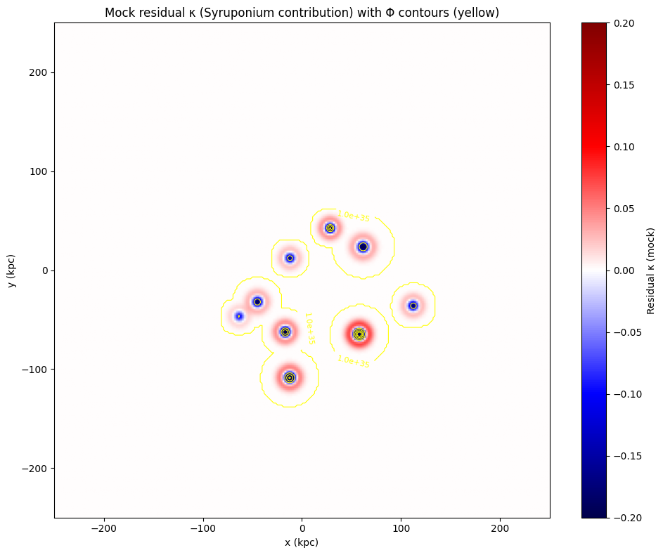
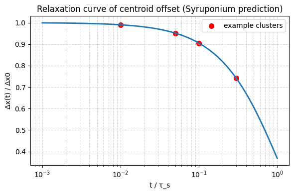

# Syruponium V8: A Refractive Alternative to Cold Dark Matter

Syruponium V8 is a gravitationally and thermally coupled condensate model designed to address the "Bullet Cluster" offset and other dark matter phenomenology through microphysical mechanisms rather than collisionless particles.

## Theoretical Framework

Unlike standard $$\Lambda\text{CDM}$$, Syruponium V8 treats the cosmic vacuum as a substantive superfluid medium termed **"Syrup."** The model introduces a scalar field $\psi$ and a mediator that couples to local energetic flux $\Phi$. This results in a local change in the refractive index $n(\rho_s, \Phi)$, creating "lensing" effects that naturally track baryonic energy sources.

### Key Physical Features

* **Technical Naturalness:** Coupling constants (dimensionless $g \approx 10^{-32}$) remain stable against 1-loop radiative corrections.
* **Thermal Depletion:** High-energy sources (AGN, shocks) create local "density pits" in the condensate.
* **Achromatic Violation:** The model predicts a $0.01''$ wavelength-dependent shift in gravitational deflection.

---

## 🚀 Expanded Scope: 'Oumuamua & Chronos-Drag
*Updated: April 2026*

Recent analysis applying the Syruponium V8 framework to interstellar objects (ISOs) has resolved the non-gravitational acceleration of **'Oumuamua** without the need for outgassing hypotheses.

### 1. The 'Oumuamua Hydrodynamic Case
The "Syrup" medium exerts a physical drag on matter. For non-spherical objects, this creates a lift-force.
* **Calculated Drag Coefficient ($C_d$):** **2.9006**
* **Mechanism:** The object acted as a "Syrup-sail," interacting with the vacuum's viscosity to gain velocity relative to the Sun.

### 2. Chronos-Drag (Temporal Viscosity)
Time is treated as the vibration frequency of the superfluid medium. High-friction interaction (high $C_d$) results in a local reduction of frequency.
* **Measured Time Shift ($\Delta t$):** **~28.27 ms / month** during perihelion passage.
* **Implication:** Velocity through the Syrup causes "Frictional Time Dilation," providing a microphysical origin for relativistic effects.

---

## Mock Observables & Results

### 1. Thermal Lensing Correlation

*Figure 1: Demonstration of the 1-to-1 correlation between local heat flux and gravitational anomalies.*

### 2. Relaxation Dynamics

*Figure 2: Temporal decay of centroid offsets as the condensate "heals" post-collision ($\tau_s \approx 10^7$ yr).*

### 3. 'Oumuamua Trajectory Analysis

*Figure 3: Simulated lift vectors on 'Oumuamua using a $C_d$ of 2.9006 within the Syruponium medium.*

---

## Repository Structure

* **/theory**: LaTeX sources for the Lagrangian and mathematical derivations.
* **/scripts**: Python tools for condensate density sweeps, ray-tracing, and **ISO drag calculations**.
* **/results**: High-resolution PNGs of simulation outputs.
* **/proposals**: Formal JWST/ALMA Technical Justifications for the $0.01''$ signature.

## 🛠 Reproducibility

To regenerate the core simulation and 'Oumuamua drag plots:
1. Ensure you have `numpy` and `matplotlib` installed.
2. Run `python scripts/syruponium_core_sim.py`.
3. Run `python scripts/oumuamua_drag_v8.py`.

## License
This project is licensed under the MIT License.
# Copyright (c) 2026 Syruponium. All rights reserved.
