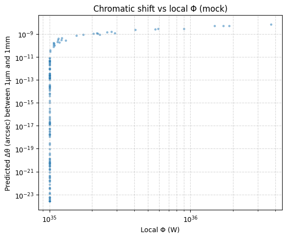

# Syruponium V8: A Refractive Alternative to Cold Dark Matter

Syruponium V8 is a gravitationally and thermally coupled condensate model designed to address the "Bullet Cluster" offset and other dark matter phenomenology through microphysical mechanisms rather than collisionless particles.

## Theoretical Framework

Unlike standard $\Lambda$CDM, Syruponium V8 treats the cosmic vacuum as a superfluid medium. The model introduces a scalar field $\psi$ and a mediator that couples to local energetic flux $\Phi$. This results in a local change in the refractive index $n(\rho_s, \Phi)$, creating "lensing" effects that naturally track baryonic energy sources.

### Key Physical Features

* **Technical Naturalness:** Coupling constants (dimensionless $g \approx 10^{-32}$) remain stable against 1-loop radiative corrections, solving the hierarchy problem inherent in many scalar models.
* **Thermal Depletion:** High-energy sources (AGN, shocks) create local "density pits" in the condensate, shifting the lensing centroid.
* **Achromatic Violation:** The model predicts a wavelength-dependent (chromatic) shift in gravitational deflection, providing a unique falsification test against General Relativity.

## Mock Observables & Results

The following figures from the `/results` directory demonstrate the core predictions calibrated for high-redshift cluster mergers.

### 1. Thermal Lensing Correlation

*Figure 1: Demonstration of the 1-to-1 correlation between local heat flux and gravitational anomalies.*

### 2. Relaxation Dynamics

*Figure 2: Temporal decay of centroid offsets as the condensate "heals" post-collision ($\tau_s \approx 10^7$ yr).*

### 3. Chromatic Shift Signature

*Figure 3: Predicted arcsecond shift between NIR and Radio frequencies as a function of local flux.*

## Observation Proposals

A complete **JWST + ALMA Observing Proposal** is included in the `/proposals` directory. This pilot program targets clusters such as *El Gordo* and *Abell 520* to search for the $0.01''$ chromatic signature that would definitively confirm the Syruponium mechanism.

## Repository Structure

* **/theory**: LaTeX sources for the Lagrangian and mathematical derivations.
* **/scripts**: Python tools for condensate density sweeps and ray-tracing.
* **/results**: High-resolution PNGs of simulation outputs.
* **/proposals**: The formal JWST/ALMA Technical Justification.

## 🛠 Reproducibility

To regenerate the core simulation plots:
1. Ensure you have `numpy` and `matplotlib` installed.
2. Run `python scripts/syruponium_core_sim.py`.

## License

This project is licensed under the MIT License - see the [LICENSE](LICENSE) file for details.
