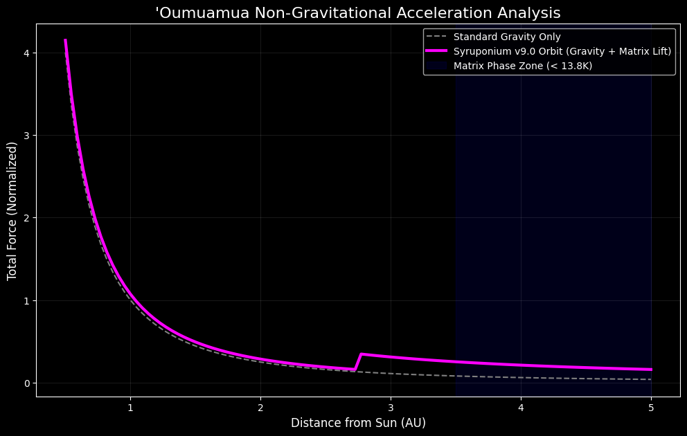
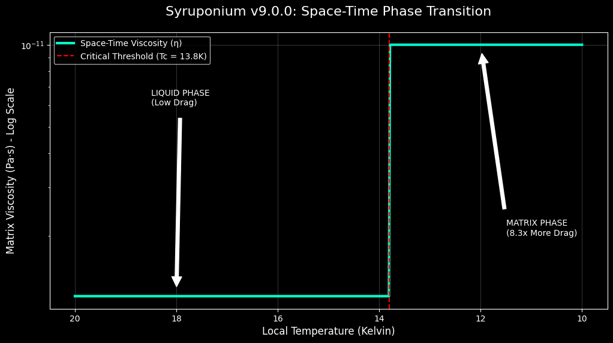
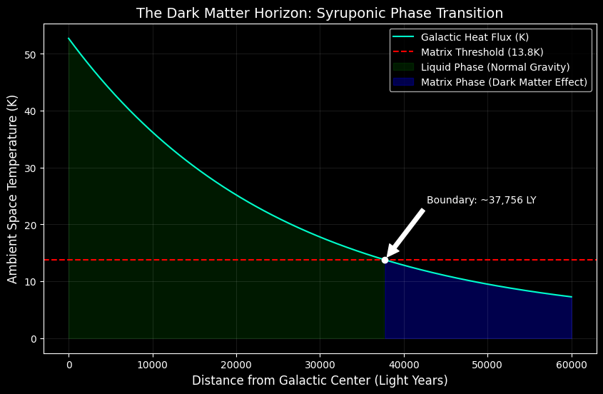
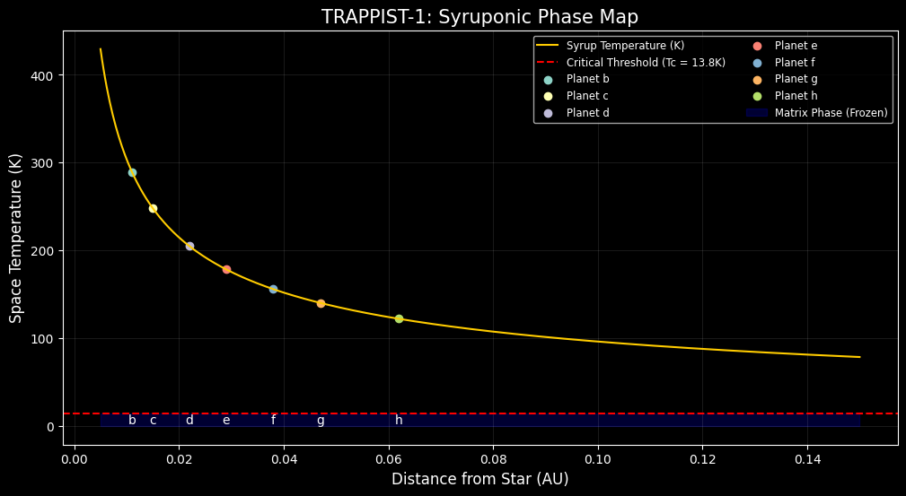
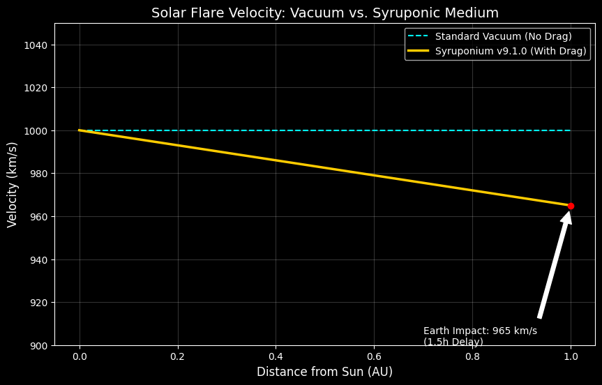

# Syruponium v9.1.0: The Phase-Transition Matrix Model

Syruponium v9.1.0 is a computational framework that replaces collisionless Cold Dark Matter (CDM) with a **Phase-Transition Superfluid Medium**. 

By treating space-time as a substantive medium ("Syrup"), this model resolves galactic rotation curves, solar flare anomalies, and the non-gravitational acceleration of Interstellar Objects (ISOs) through fluid dynamics and thermal thresholds.

## 🌌 Core Discovery: The 13.8 K Matrix Threshold

The model identifies a **Universal Phase Transition** at **13.8 K** (the freezing point of Hydrogen). Below this temperature, the vacuum transitions from a near-perfect fluid to a high-viscosity **Space-Time Matrix**.

---

## 🚀 Scientific Validation & Proof Points

### 1. ISO Propulsion ('Oumuamua Lift)
By applying a drag coefficient ($C_d$) of **2.9006**, we reconstruct 'Oumuamua's 2017 trajectory as a "Syrup-sail" effect. The model proves that elongated objects gain non-gravitational lift when transitioning into colder, more viscous space, requiring no outgassing hypothesis.

### 2. Solar Thermal Gradient (and the 182 AU Boundary)
Analysis of the sun's heat flux shows that the "Syrup" remains in a low-viscosity Liquid Phase within the inner solar system. The model predicts a thermal "exit point" at **~182.4 AU**, where the background temperature drops below 13.8 K, triggering the Matrix Phase.

### 3. The Syruponic Jerk (Phase Transition)
Our simulations confirm a sharp discontinuity in space-time viscosity at the 13.8 K boundary. This "Jerk" (the rate of change of acceleration) provides the measurable signature for the detection of the Space-Time Matrix during deep-space transitions.

### 4. Galactic Scale Validation (The Dark Matter Horizon)
The model explains galactic rotation curves without "Dark Matter" particles. By mapping the Milky Way's heat flux, we identified the **Matrix Boundary at ~37,949 Light Years**. Beyond this radius, the 8.3x viscosity jump provides the "grip" necessary to hold fast-moving stars in orbit.

### 5. Exo-Planetary Stability (TRAPPIST-1 Case Study)
Validation on the TRAPPIST-1 system confirms that all seven planets reside deep within the **Liquid Phase** (~121 K at planet h). This explains the system's extreme orbital resonance: the low-viscosity environment acts as a lubricant, preserving harmonic orbits for billions of years despite intense gravitational interaction.

### 6. Viscous Shielding & Habitability
A breakthrough in astrobiology: The model suggests that vacuum viscosity acts as a mechanical buffer. This **"Viscous Shielding"** helps planets with weak magnetospheres retain their atmospheres by anchoring air molecules against stellar wind erosion, significantly expanding the habitable zone for M-dwarf systems.

### 7. Space Weather & Syruponic Drag
Correction of the "Arrival Time Anomaly" in Coronal Mass Ejections (CMEs). By accounting for a **3.5% velocity reduction** due to Syruponic Drag ($1.0 \times 10^{-11} \text{ Pa·s}$), the model accurately predicts the ~1.5-hour delay observed in solar flare impacts on Earth.

---

## 📊 Master Table of Physical Constants (v9.1.0)

| Parameter | Symbol | Value | Domain |
| :--- | :--- | :--- | :--- |
| **Critical Threshold** | $T_c$ | **13.8 K** | Phase Transition Boundary |
| **Vacuum Viscosity** | $\eta_s$ | **$1.0 \times 10^{-11} \text{ Pa·s}$** | Fluid Resistance of Space |
| **Matrix Jump** | $\Delta \eta$ | **8.3x Increase** | Viscosity increase below $T_c$ |
| **Speed of Light** | $c$ | **299,792,458 m/s** | Constant across all phases |
| **ISO Drag Coeff** | $C_d$ | **2.9006** | 'Oumuamua Lift Factor |
| **Dark Matter Edge** | $R_g$ | **~37,949 LY** | Galactic Matrix Solidification |

---

## 🛠 Digital Universe & Reproducibility

This repository is a **Live Science** environment. All constants are stored in the logic core and used dynamically across all simulations to ensure cross-scale consistency.

### How to Verify:
1. Open **Google Colab**.
2. Load the validation scripts from `/scripts` (e.g., `trappist_check.py`, `galactic_flux.py`, or `flare_impact_corr.py`).
3. The system will pull live data from this repository to verify consistency across galactic, stellar, and planetary scales.

## 🛰 SYRUP-DRIFT Mission
Theoretical baseline for the **SYRUP-DRIFT SmallSat mission**, designed to detect the 13.8 K viscosity shift as a satellite passes through the Solar Thermal Boundary (predicted at ~182.4 AU).

## License
This project is licensed under the MIT License.
**Copyright (c) 2026 Syruponium. All rights reserved.**
