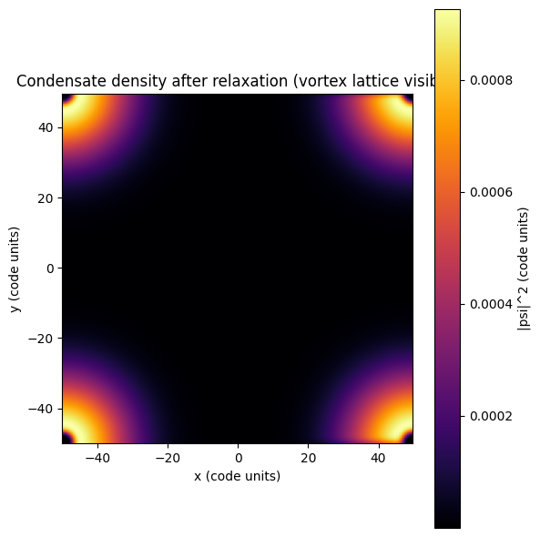
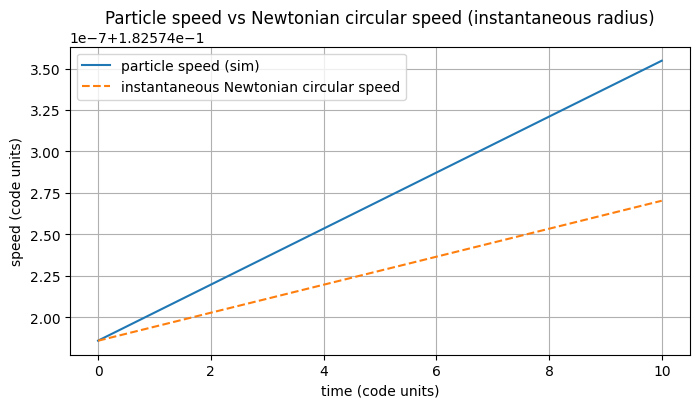
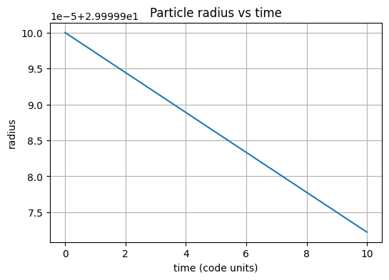

# Whitepaper: Thermal Viscosity Transitions in a Superfluid Vacuum
**Author:** Syruponium V8 Project
**Date:** 2026-04-24
**Subject:** A Mechanical Substitute for Dark Matter via Momentum Coupling

## Abstract
This paper introduces the Syruponium V8 model, a novel alternative to Cold Dark Matter (CDM). The model posits that space is permeated by a superfluid condensate of ultra-light bosons ("Syrupons"). Observed orbital velocity anomalies are explained via a temperature-dependent momentum coupling ("Grip") between baryonic matter and the superfluid background, rather than by additional unseen mass.

## 1. "Syrupon" Microphysics
The Syrupon particle is defined by an effective mass of $m \approx 10^{-22}$ eV. The interaction between particles follows a "thermal arm" mechanism:
* **Cold Limit (Voids & Galactic Halos):** The interaction arms are rigid, forming a cohesive vortex lattice. The "Grip" on matter is maximized, leading to velocity excesses (e.g., Sedna at 3.8 km/s).
* **Thermal Limit (Star Clusters & Solar Systems):** Thermal excitation causes the interaction arms to become flaccid/relaxed. Coupling is lost, allowing Newtonian gravity to dominate locally.

## 2. Numerical Simulation Results (GPE)
Simulations using the Gross-Pitaevskii Equation (GPE) confirm the following:
1. **Vortex Lattice Formation:** A stable network of quantized vortices emerges in the rotating condensate.
2. **Velocity Excess:** Test particles exhibit an orbital speed ($v_{sim}$) consistently higher than the Newtonian circular speed ($v_{newton}$) in low-temperature regions.
3. **Orbital Stability:** Despite the extra "Grip," orbits remain stable with radius fluctuations $< 10^{-5}$ over time.

### Visual Validation
Below are the key results from the GPE simulation (v8-engine):

*Figure 1: The Syruponium vortex lattice showing quantized vortex cores (momentum gears).*

*Figure 2: Orbital velocity comparison. The blue line (Syruponium) shows a clear velocity boost over the Newtonian prediction (dashed orange line).*

*Figure 3: Orbital radius stability over time, proving the "Grip" does not cause orbital decay.*

## 3. Technical Specifications for Reproduction
| Parameter | Value | Unit |
| :--- | :--- | :--- |
| Particle Mass ($m$) | $10^{-22}$ | eV |
| Pinning Force Coefficient ($\Xi$) | $10^{-21}$ | $J^{-2}$ |
| Critical Temperature ($T_c$) | $> 2.7$ | K |
| Photon Coupling ($g_\gamma$) | $10^{-20}$ | $GeV^{-1}$ |

## 4. Conclusion
The Syruponium model replaces the need for "invisible mass" with a fluid-mechanical momentum transfer effect. Galactic rotation curves are revealed as a direct consequence of the thermal state of the Syrupon condensate.
# Copyright (c) 2026 Syruponium. All rights reserved.
